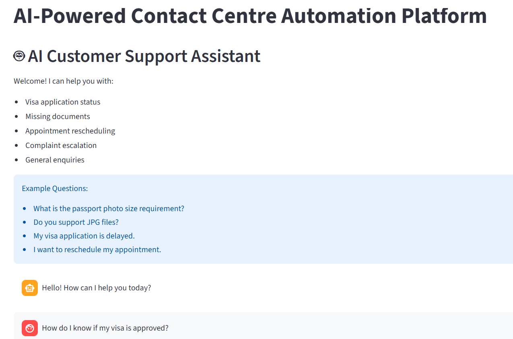
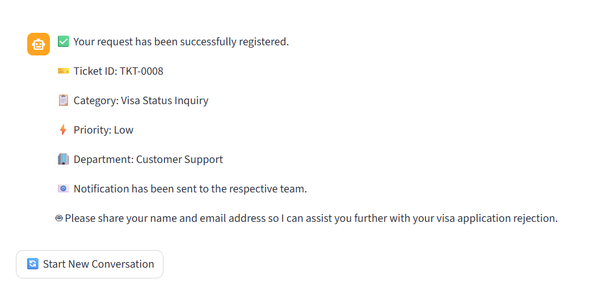
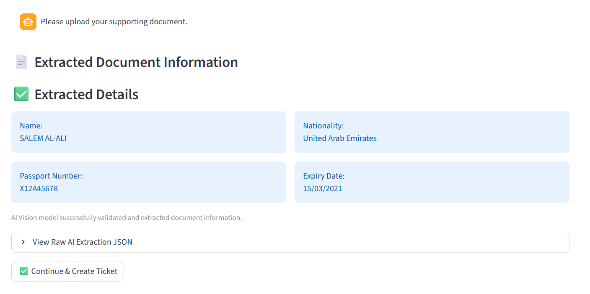
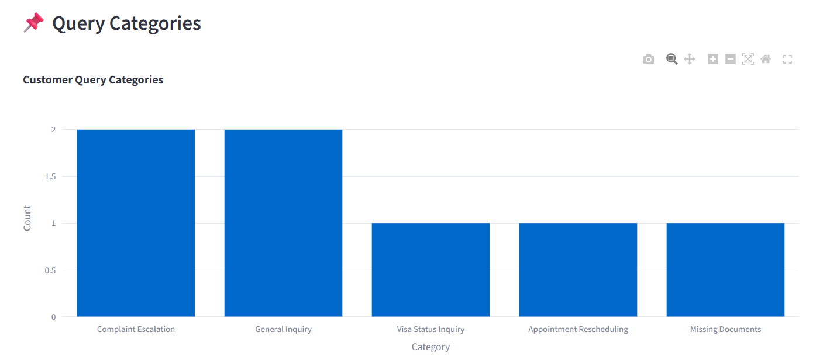
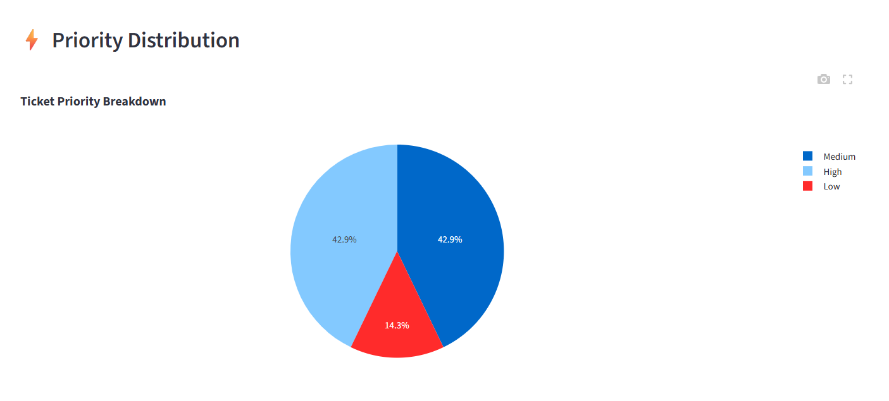
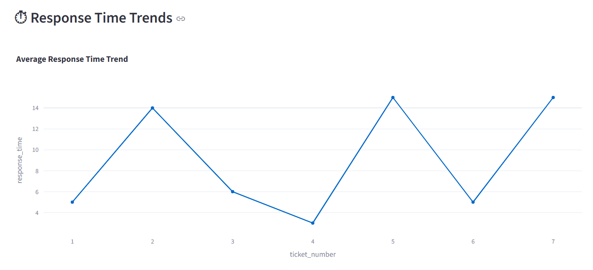
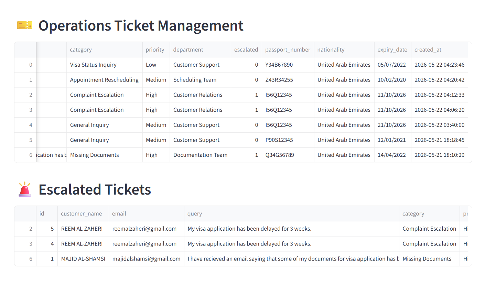

# CC Automation: AI-Powered Contact Centre Platform

> An intelligent, end-to-end customer support automation system for visa processing contact centres, combining Conversational AI, Vision-based Document Understanding, Ticket Automation, and Operational Analytics into a single unified platform.

## Live Demo
https://ccagent.streamlit.app

## Overview

Customer support teams handling visa and immigration services currently process high volumes of repetitive queries manually,  including status enquiries, missing document requests, appointment rescheduling, and complaint escalations. This leads to delayed responses, operational inefficiencies, and inconsistent customer experience.

**CC Automation** addresses this by deploying a layered AI automation platform that:

- Understands customer intent through a conversational AI assistant
- Validates and extracts data from uploaded identity documents using Vision AI
- Automatically creates, categorises, and routes support tickets
- Surfaces operational insights through a real-time analytics dashboard

The system is built entirely on **free-tier and open-source technologies**, making it practical to deploy and demonstrate without infrastructure costs.


## Key Features

### Conversational AI Assistant
- Multi-turn conversation memory across a session
- Customer intent recognition and query classification
- AI-generated, context-aware support responses
- Built-in FAQ handling for common visa enquiries
- Automatic escalation detection and flagging

### Intelligent Document Processing
- Vision LLM-based document understanding (no rigid template matching)
- Supports **Passport**, **Visa Copy**, and **Emirates ID**
- Extracts structured fields: name, document number, nationality, expiry date
- Detects invalid, blurry, or irrelevant image uploads
- Flags missing fields and marks documents as valid or rejected

### Ticket Automation
- Automatic ticket generation on every customer interaction
- AI-assigned priority (`Low` / `Medium` / `High`)
- Department routing based on query category
- Escalation workflows with flagging and tracking
- Full ticket history stored in a structured SQLite database

### Operational Analytics Dashboard
- Live metrics: total tickets, escalation count, avg response time, rejected documents
- Query category distribution (bar chart)
- Ticket priority breakdown (pie chart)
- Department assignment distribution
- Response time trends per ticket
- Document rejection statistics


## System Architecture

```
Customer Input (Chat / Document Upload)
              │
              ▼
   ┌─────────────────────┐
   │  Conversational AI  │  ◄── Llama 3.1 8B (via Groq)
   │  (chatbot.py)       │      Multi-turn memory · Intent · FAQ · Escalation
   └────────┬────────────┘
            │
            ▼
   ┌─────────────────────┐
   │  Document Upload    │
   │  (document_         │  ◄── Llama 4 Scout Vision LLM
   │   processor.py)     │      Validate · Extract · Flag missing fields
   └────────┬────────────┘
            │
            ▼
   ┌─────────────────────┐
   │  Ticket Manager     │  ◄── ticket_manager.py
   │                     │      Create · Prioritise · Route · Escalate
   └────────┬────────────┘
            │
            ▼
   ┌─────────────────────┐
   │  SQLite Database    │  ◄── db.py
   │  (tickets.db)       │      Persistent ticket + document storage
   └────────┬────────────┘
            │
            ▼
   ┌─────────────────────┐
   │  Analytics          │  ◄── dashboard.py + Plotly
   │  Dashboard          │      Operational insights · KPIs · Trends
   └─────────────────────┘
```

---

## Tech Stack

| Layer | Technology | Purpose |
|---|---|---|
| Frontend | Streamlit | UI - chat interface, document upload, dashboard |
| Conversational AI | Groq + Llama 3.1 8B Instant | Query understanding, classification, response |
| Vision AI | Llama 4 Scout 17B | Document validation and field extraction |
| Database | SQLite | Ticket and document data storage |
| Analytics | Plotly | Interactive dashboard charts |
| Backend | Python 3.11+ | Application logic and module orchestration |
| Config | python-dotenv | Secure API key management |
| Deployment | Streamlit Community Cloud | Free-tier hosting |


## Project Structure

```
CC_AUTOMATION/
│
├── app.py                      # Main Streamlit entry point
├── .env                        # API keys (not committed to version control)
├── requirements.txt
├── README.md
│
├── Database/
│   ├── db.py                   # SQLite connection and schema initialisation
│   └── tickets.db              # Auto-generated database file
│
├── modules/
│   ├── chatbot.py              # Conversational AI - Groq + Llama 3.1
│   ├── document_processor.py   # Vision AI - document extraction and validation
│   ├── ticket_manager.py       # Ticket CRUD operations
│   ├── dashboard.py            # Streamlit dashboard rendering
│   └── utils.py                # File saving and notification helpers
│
└── uploads/                    # Temporary document upload storage
```


## Getting Started

### Prerequisites

- Python 3.11 or higher
- A free [Groq API key](https://console.groq.com) - used for both the LLM and Vision model

### 1. Clone the Repository

```bash
git clone https://github.com/your-username/cc-automation.git
cd cc-automation
```

### 2. Create and Activate a Virtual Environment

```bash
# Create
python -m venv venv

# Activate — Windows
venv\Scripts\activate

# Activate — Linux / macOS
source venv/bin/activate
```

### 3. Install Dependencies

```bash
pip install -r requirements.txt
```

### 4. Configure Environment Variables

Create a `.env` file in the project root:

```env
GROQ_API_KEY=your_groq_api_key_here
```

> ⚠️ Never commit your `.env` file. It is listed in `.gitignore`.

### 5. Run the Application

```bash
streamlit run app.py
```

The app will open at `http://localhost:8501`.


## Module Breakdown

### `chatbot.py`
Handles all conversational AI logic using **Llama 3.1 8B Instant** via the Groq API. Accepts the customer's message and the current session's conversation history, and returns a structured JSON object containing:

```json
{
  "category": "Visa Status Inquiry",
  "priority": "High",
  "department": "Visa Processing",
  "escalated": true,
  "response": "We have received your query and escalated it for priority handling."
}
```

Built-in FAQ shortcuts handle common queries (visa status checks, processing times, required documents) without consuming LLM tokens.


### `document_processor.py`
Uses **Llama 4 Scout**, a Vision Language Model, to process uploaded document images. The module:

1. Detects the document type (`passport`, `visa`, `emirates_id`, or `unknown`)
2. Extracts structured fields for each document type
3. Validates completeness and flags any missing fields
4. Rejects invalid or irrelevant image uploads

**Supported document types and extracted fields:**

| Document | Fields Extracted |
|---|---|
| Passport | Name, Passport Number, Nationality, Expiry Date |
| Visa Copy | Visa Number, Visa Type, Name, Nationality, Expiry Date |
| Emirates ID | ID Number, Name, Nationality, Expiry Date |


### `ticket_manager.py`
Manages all ticket database operations. Every customer interaction triggers automatic ticket creation. Returns a formatted ticket reference (e.g. `TKT-0042`). All tickets are retrievable for the dashboard via `get_all_tickets()`.


### `dashboard.py`
Renders the full operational analytics dashboard using Streamlit and Plotly. Consumes ticket data from the database and visualises KPIs, trends, escalations, and document rejection rates.


### `db.py`
Initialises the SQLite database and provides a connection helper. The `tickets` table stores all customer interaction data including extracted document fields.


## Dashboard Metrics

| Metric | Visualisation |
|---|---|
| Total support requests | KPI card |
| Escalated tickets | KPI card |
| Average response time | KPI card |
| Rejected documents | KPI card |
| Query category distribution | Bar chart |
| Ticket priority breakdown | Pie chart |
| Department assignment | Bar chart |
| Response time per ticket | Line chart |
| Document validation results | Pie chart |
| Escalated ticket details | Data table |
| Most common issues | Data table |


## Security Considerations

| Consideration | Implementation |
|---|---|
| API key management | Stored in `.env`, loaded via `python-dotenv`, never hardcoded |
| Document storage | Uploaded files stored temporarily in `/uploads` only |
| File type restriction | Only `.jpg`, `.jpeg`, `.png` accepted for document uploads |
| No credential exposure | No API keys or secrets in source files or version control |
| Interface separation | Customer-facing chat and operations dashboard are isolated pages |
| Future-ready | Modular architecture supports adding RBAC and authentication layers |


## Scalability Roadmap

The current prototype uses lightweight, free-tier components. The architecture is intentionally modular to support enterprise-grade upgrades:

| Component | Current | Future |
|---|---|---|
| Database | SQLite | PostgreSQL / Azure SQL / Cosmos DB |
| AI Models | Groq (Llama) | Azure OpenAI / Anthropic Claude API |
| Notifications | Simulated | SendGrid / Twilio / Microsoft Graph |
| CRM Integration | None | Salesforce / Microsoft Dynamics 365 |
| Deployment | Streamlit Cloud | Azure App Service / AWS ECS |
| Auth | None | Azure AD B2C / Auth0 + RBAC |
| Analytics | Plotly / Streamlit | Power BI / Azure Synapse |
| Memory | Session state | Vector database (Pinecone / Chroma) |
| Language Support | English | Multilingual AI (Arabic, Hindi, etc.) |


## Supported Use Cases

The following query types are handled end-to-end by the platform:

- *"My visa application status has not been updated for two weeks."*
- *"I need to reschedule my appointment, I have a conflict."*
- *"My passport upload was rejected. What am I doing wrong?"*
- *"I accidentally uploaded the wrong document."*
- *"I want to formally escalate my complaint regarding processing delays."*
- *"What documents do I need for my visa application?"*
- *"How long does the standard visa processing take?"*


## Future Enhancements

- **Real CRM integration** - write tickets and customer records directly to Salesforce or Dynamics 365
- **Microsoft 365 / Power Automate workflows** - trigger automated email and approval flows
- **Voice AI assistant** - speech-to-text input for accessibility
- **Sentiment analysis** - detect frustrated customers in real time and auto-escalate
- **Fraud detection** - flag potentially forged or manipulated document uploads
- **Human-in-the-loop review** - agent interface for reviewing AI-flagged edge cases
- **Vector database memory** - persistent cross-session conversation memory using embeddings
- **Azure AI Services migration** - enterprise-grade OCR, Form Recogniser, and document intelligence


# Screenshots

## Conversational AI Chatbot

The AI chatbot handles customer enquiries, identifies intent, answers FAQs and initiates automated support workflows.




## Automated Ticket Creation

The system automatically classifies requests, assigns departments, prioritizes cases and generates support tickets.




## AI-Powered Document Extraction

Using a Vision Language Model (Llama 4 Scout), the platform validates uploaded documents and extracts structured information automatically.




## Operational Analytics Dashboard

The dashboard provides operational insights including:

- Query category distribution
- Ticket priority analysis
- Average response time trends
- Escalation monitoring
- Document rejection metrics

### Sample Dashboard Visualizations

| Query Distribution | Priority Analysis | Response Time Trends |
|---|---|---|
|  |  |  |


## Operations Ticket Management

Support teams can monitor and manage generated tickets, escalations and operational workflows through the management dashboard.




## License

All AI model usage is through free-tier API access (Groq). No proprietary data or credentials are included in this repository.


*Built with Streamlit . Groq . Llama . Plotly . SQLite . Python*